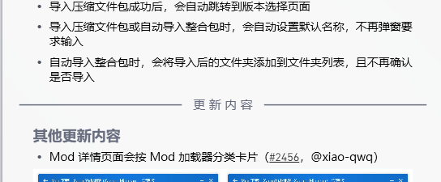

构建结构 UpdateHomepage文件夹可以看看（？ 
 
 先塞Style文件夹乱七八糟的

 New.xaml  需求：占位符位置塞东西 ImageLink塞图片 file_name塞Markdown标题

 Markdown文章（Markdown需要塞个更新内容的线 现在是魔改了hr.xaml(主页中间那个 更 新 内 容 的分隔线  
 
 Cantupdate (你MC新闻那个类似的 有Json文件内新版本但本地没有对于Markdown新版本就塞入一个没更新 读取Github API 有新版本就塞 没新版本就不塞（
 
 historyline 一个分割线
 History 版本历史（人工）
 PRlist （人工）
 NewFooter 魔改的结束卡片

其他...
 （还需要构建器跑一下VersionJson.py以生成新文件的json和ini配置文件....（塞了不知道为啥不会生成....

